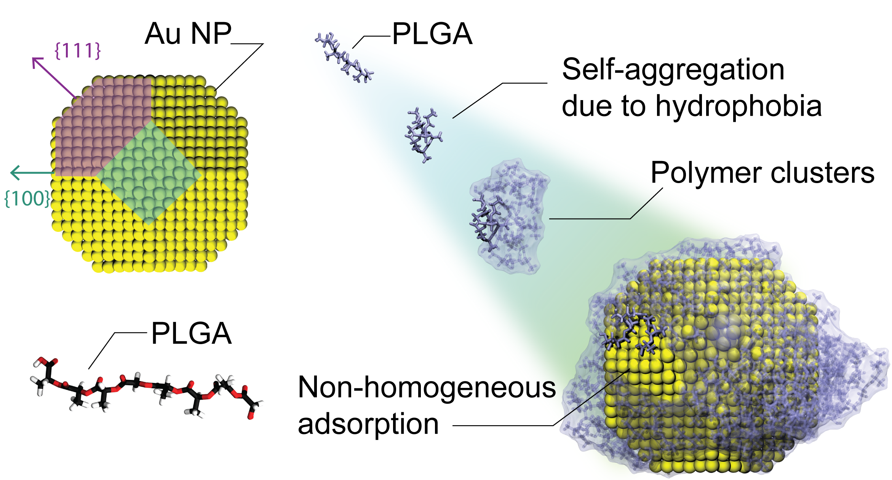

# Supporting material for the article:

<p align="center">
    <a target="_blank" href="https://python.org">
    </a>
    <a target="_blank" href="https://jupyter.org">
    </a>
    <a target="_blank" href="/LICENSE">
    </a>
    <a target="_blank" href="https://www.linux.org/">
    </a>
    <a target="_blank" href="http://www.doi.org/">
    </a>
</p>

## Assembling Biocompatible Polymers on Gold Nanoparticles: Towards a Rational Design of Particle Shape by Molecular Dynamics

<p align="center">
<a href="TO BE DEFINE">
</a>
</p>

In this repository are stored the Jupyter Notebooks used in the article [ARTICOLO](ARTICOLO) to:

1. Define the geometry and topology of a bare gold nanoparticle;

2. To study the self-assembly and adsorption phenomena of PLGA polymers onto a AuNP surface through post-processing analysis.

Furthermore, are shared the input files of the Packmol code and of the GROMACS software needed to repeat the work described in the article [ARTICOLO](ARTICOLO).

## Table of contents

- [🎉 Installation](#-installation)
  * [Using `pip`](#using-pip)
  * [Installing `packmol`](#install-packmol)
  * [Installing `gromacs`](#install-gromacs)
- [🚀 Usage](#-examples)
  * [`0-AuNP.ipynb`](#using-AuNP)
  * [`1-setup_self-assembly.ipynb`](#using-setup_self-assembly)
  * [`2-unsupervised_learning.ipynb`](#using-unsupervised_learning)
  * [`3-SASA_analysis.ipynb`](#using-SASA_analysis)
  * [`4-setup_US.ipynb`](#using-setup_US)
- [🚩 License](#-license)
- [🎖️️️ CREDITS](#-creditscreditsmd)

## 🎉 Installation

### <a name="using-pip" />  Using `pip`

<details>

#### Clone repository

```console
git clone https://github.com/robertacappabianca/SM_AuNP_PLGA.git
```

#### Set-up virtual environment (optional)

1. create a virtual environment `venv_AuNP`

```console
# python3 -m venv <Virtual environment name>
python3 -m venv venv_AuNP
```
2. activate it
```console
source venv_AuNP/bin/activate
```

#### Install dependencies

1. move in the *SM_AuNP_PLGA* folder
```console
cd SM_AuNP_PLGA
```

2. download and install the requirements with `pip` (Package Installer for Python)
```console
pip install -r requirements.txt
```
</details>

### <a name="install-packmol" />  Installing `packmol`

<details>

1. Clone from repository
```console
git clone https://github.com/m3g/packmol.git
```

2. Compile it
```console
cd packmol
make
```

3. (optional) create a symbolic link to local `bin` folder

```console
ln -s $(pwd)/packmol /home/$USER/.local/bin/packmol
```
</details>

### <a name="install-gromacs" />  Installing `gromacs`

The installation guide can be found at [http://manual.gromacs.org/documentation/current/install-guide/index.html](http://manual.gromacs.org/documentation/current/install-guide/index.html)


## 🚀 Usage

### <a name="using-AuNP" />  Using `0-AuNP.ipynb`

To define the geometry of a bare gold nanoparticle with a diameter of 4 nm. The procedure adopted is flexible enough so that it is easy to change the nanoparticle morphology and evaluate its effects on the adsorption phenomenon. (see in the [article](ARTICOLO) 'Results and discussion': figure 6)

### <a name="using-setup_self-assembly" />  Using `1-setup_self-assembly.ipynb`

To simulate the self-assembly of PLGA on a gold nanoparticle in aqueous solution by performing simulations with our Molecular Dynamics protocol using the free software GROMACS.

### <a name="using-unsupervised_learning" />  Using `2-unsupervised_learning.ipynb`

To perform a clustering analysis by adapting the HDBSCAN* algorithm to investigate the time evolution of self-assembly pathways of the polymer chains.

### <a name="using-SASA_analysis" />  Using `3-SASA_analysis.ipynb`

To analyze the four case studies by monitoring the solvent accessible surface area (SASA) per crystal plane during the simulations. In fact, a reduction in the water accessible surface area has a significance equivalent to an improved
in the adsorption of PLGA on the specific plane of the NP.

### <a name="using-setup_US" />  Using `4-setup_US.ipynb`

To explore the Free Energy Landscape (FEL) using the improved Umbrella Sampling (US) method. Specifically, this notebook jupyter describes how to extract the Potential of Mean Force (PMF) of a single PLGA polymer chain adsorbing on the AuNP by varying their reciprocal angular positions. (see in the [article](ARTICOLO) 'Results and discussion': figure 4)

> **NOTE** `4.1-rotation_NP.ipynb` needs to calculate the axis and angles of rotation to rotate the nanoparticle.

---

#### **Note:** In the main article, we replicated the simulations in order to determinate the mean values and statistical variance of the results.


## 🚩 License
The code is available under the [GNU General Public License v3.0](LICENSE).

## 🎖️️️ [CREDITS](CREDITS.md)
